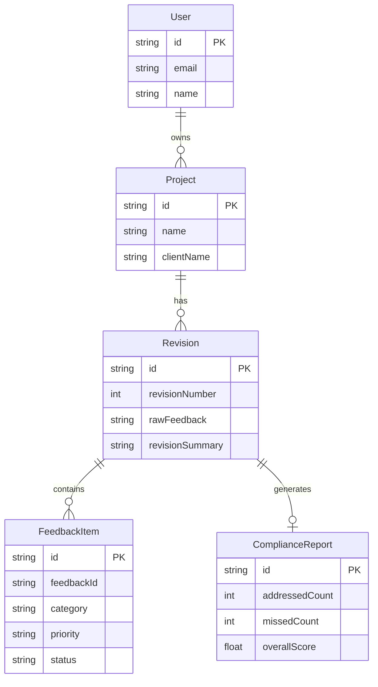

# 🎯 Client Feedback Enforcer

> **Internal Agency Tool** — Ensure every piece of client feedback is addressed before work goes back.

[](https://nextjs.org/)
[](https://reactjs.org/)
[](https://www.typescriptlang.org/)
[](https://tailwindcss.com/)
[](https://www.prisma.io/)
[](https://www.postgresql.org/)

---

## 🚨 The Problem

In design agencies like Figmenta:

- ❌ Clients give feedback in **messy, unstructured ways**
- ❌ Feedback gets **lost across revisions**  
- ❌ Designers **unintentionally miss items**
- ❌ Clients get frustrated: *"We already told you this."*

**This causes:**
- Extra revision cycles
- Burned hours
- Trust issues with clients

---

## 💡 The Solution

A system that ensures **every piece of client feedback is either addressed or flagged** before work is sent back.

**Not creativity. Not advice. Accountability.**

---

## 🔄 User Flow

### Step 1: Paste Client Feedback
```
"CTA not visible enough"
"Hero image feels generic"  
"Tone is too corporate"
```

### Step 2: AI Structures It
The system converts raw feedback into:
| Feedback ID | Category | Priority | Required Action |
|-------------|----------|----------|-----------------|
| FB-001 | Design | High | Increase CTA visibility |
| FB-002 | Design | Medium | Replace hero image |
| FB-003 | Copy | Medium | Adjust tone of voice |

### Step 3: Paste Revision Summary
Designer pastes their work summary:
```
"Increased CTA contrast, changed hero image, adjusted copy tone"
```

### Step 4: AI Checks Compliance
The system compares feedback list against revision summary.

### Step 5: Magic Output ✨

```
✅ ADDRESSED:
  • CTA visibility - Increased contrast ✓
  • Hero image - Changed ✓

❌ MISSED:
  • Copy tone - Still too corporate

⚠️ NEEDS CLARIFICATION:
  • "What level of brand tone change is acceptable?"
```

**Designer fixes issues before the client ever sees it.**

---

## 🛠️ Tech Stack

### Frontend
| Technology | Version | Purpose |
|------------|---------|---------|
| Next.js | 16.0.10 | React framework (App Router) |
| React | 19.2.0 | UI library |
| TypeScript | ^5 | Type-safe JavaScript |
| Tailwind CSS | ^4.1.9 | Utility-first CSS framework |
| Framer Motion | ^12.23.26 | Smooth animations |
| Radix UI | Various | Accessible UI primitives |
| Recharts | 2.15.4 | Charts & data visualization |
| Lucide React | ^0.454.0 | Beautiful icons |

### Backend / Database
| Technology | Version | Purpose |
|------------|---------|---------|
| Prisma | ^5.22.0 | ORM / Database toolkit |
| PostgreSQL | 15+ | Primary database |
| Next.js API Routes | — | Server-side API endpoints |

---

## 🚀 Getting Started

### Prerequisites

- Node.js 18.17 or later
- PostgreSQL 15+
- npm or yarn

### Installation

1. **Clone the repository**
   ```bash
   git clone https://github.com/RichardRajuChirayath/Client-Feedback-Enforcer.git
   cd Client-Feedback-Enforcer
   ```

2. **Install dependencies**
   ```bash
   npm install
   ```

3. **Set up environment variables**
   ```bash
   cp env.example .env
   # Edit .env with your database credentials
   ```

4. **Set up the database**
   ```bash
   npx prisma migrate dev --name init
   npx prisma generate
   ```

5. **Run the development server**
   ```bash
   npm run dev
   ```


---

## 📁 Project Structure

```
client-feedback-enforcer/
├── src/
│   ├── app/                    # Next.js App Router
│   │   ├── api/               # API routes
│   │   ├── dashboard/         # Dashboard pages
│   │   └── page.tsx           # Home page
│   ├── components/            # React components
│   │   ├── ui/               # Base UI components
│   │   └── feedback/         # Feedback-specific components
│   ├── lib/                   # Utility functions
│   └── generated/             # Prisma client
├── prisma/
│   └── schema.prisma          # Database schema
├── public/                    # Static assets
└── package.json
```

---

## 📊 Database Schema



---

## 🤖 AI Integration

The system uses AI to:
1. **Parse & Structure** - Convert messy feedback into structured items
2. **Categorize** - Auto-detect Design/Copy/UX/Technical
3. **Prioritize** - Suggest priority levels
4. **Compliance Check** - Compare revisions against feedback
5. **Generate Reports** - Provide actionable insights

---

## 📝 License

MIT License - see [LICENSE](LICENSE) for details.

---

## 🤝 Contributing

Contributions are welcome! Please read our contributing guidelines first.

---

## 👨‍💻 Author

**Richard Raju Chirayath**

- GitHub: [@RichardRajuChirayath](https://github.com/RichardRajuChirayath)

---

<p align="center">
  <strong>Built with ❤️ for design agencies everywhere</strong>
</p>
