<div align="center">
    
# ⚡ CLYENTRA
### The Client Feedback Enforcer


<p align="center">
    <a href="https://nextjs.org"></a>
    <a href="https://tailwindcss.com"></a>
    <a href="https://www.typescriptlang.org"></a>
    <a href="https://prisma.io"></a>
    <a href="https://groq.com"></a>
</p>

[View Demo](#) · [Report Bug](#) · [Request Feature](#)

</div>

---

## 🚨 The Agency Problem

> *"I thought I told you to change this?"* — **Every Client, Ever.**

In the chaos of design agencies (like Figmenta), feedback is **fragmented**. It lives in:
- 📧 50-thread Email chains
- 💬 Slack DMs
- 📱 WhatsApp Voice Notes
- 📞 "Quick Calls"

**The result?** Designers miss things. Revisions pile up. Trust erodes. Money burns.

## ⚔️ The Solution: Clyentra

**Clyentra** is not a project management tool. It is a **Compliance Engine**. 

It uses **Llama 3.3 (70b-Versatile)** to deconstruct messy "Client Talk" into a rigid, non-negotiable checklist that must be cleared before work is submitted.

<div align="center">
  
</div>

---

## ⚡ Core Loops

### 1. 🧬 Feedback DNA Extraction
Paste *any* unstructured text. The AI stripes out the noise ("Hope you're well!", "Just a thought...") and extracts raw **Action Items** and **Questions**.

```mermaid
graph LR
    A[📩 Client Email] -->|Paste| B(⚡ AI Parser)
    B -->|Extract| C{Signals}
    C -->|Task| D[✅ Action Item]
    C -->|Question| E[❓ Clarification]
    C -->|Vibe| F[🎨 Sentiment Check]
    style B fill:#6366f1,stroke:#fff,stroke-width:2px,color:#fff
```



### 2. 🛡️ The Compliance Shield
Before sending a revision, the designer must "Commit" their work against the checklist.
- **AI Verification**: Checks if the designer's summary matches the client's requests.
- **Loop Prevention**: Detects if a client contradicts their *own* previous feedback.

---

## 🛠️ Cyber-Brutalist Stack

We deliberately chose a "Developer-First" aesthetic and stack to prioritize speed and reliability.

| Layer | Technology | Status |
| :--- | :--- | :--- |
| **Framework** | Next.js 16 (App Router) | 🟢 Production |
| **Styling** | Tailwind CSS v4 | 🟢 Alpha |
| **Typography** | Space Grotesk / JetBrains Mono | 🟢 Custom |
| **Intelligence** | Groq SDK (Llama 3.3) | ⚡ <100ms Latency |
| **Data** | PostgreSQL + Prisma | 🔒 Strict Schema |
| **Animations** | Framer Motion | 🌊 60fps |

---

## 🚀 Installation Protocol

**01. Clone the Repository**
```bash
git clone https://github.com/RichardRajuChirayath/Client-Feedback-Enforcer.git
```

**02. Inject Dependencies**
```bash
npm install
```

**03. Configure Environment**
```bash
cp env.example .env
# Add your GROQ_API_KEY and DATABASE_URL
```

**04. Ignite Database**
```bash
npx prisma migrate dev --name init
```

**05. Launch System**
```bash
npm run dev
```

---

## 🔮 The "Smart Fallback" Architecture

Clyentra features a robust **"Anti-Crash"** system for its Inspiration Lab.

*   **Primary Path**: Direct Web Scraping (Puppeteer-lite approach) to read live site DOM.
*   **Defense Mechanism**: If a site blocks our bot (e.g., Stripe, Apple), the system **automatically** switches to "Knowledge Mode".
*   **Result**: The user *always* gets a strategy breakdown, even if the target site is fortified.

---

<div align="center">

**Built by [Richard Raju Chirayath](https://github.com/RichardRajuChirayath)**

*"Good design is non-negotiable. Compliance is mandatory."*

</div>
